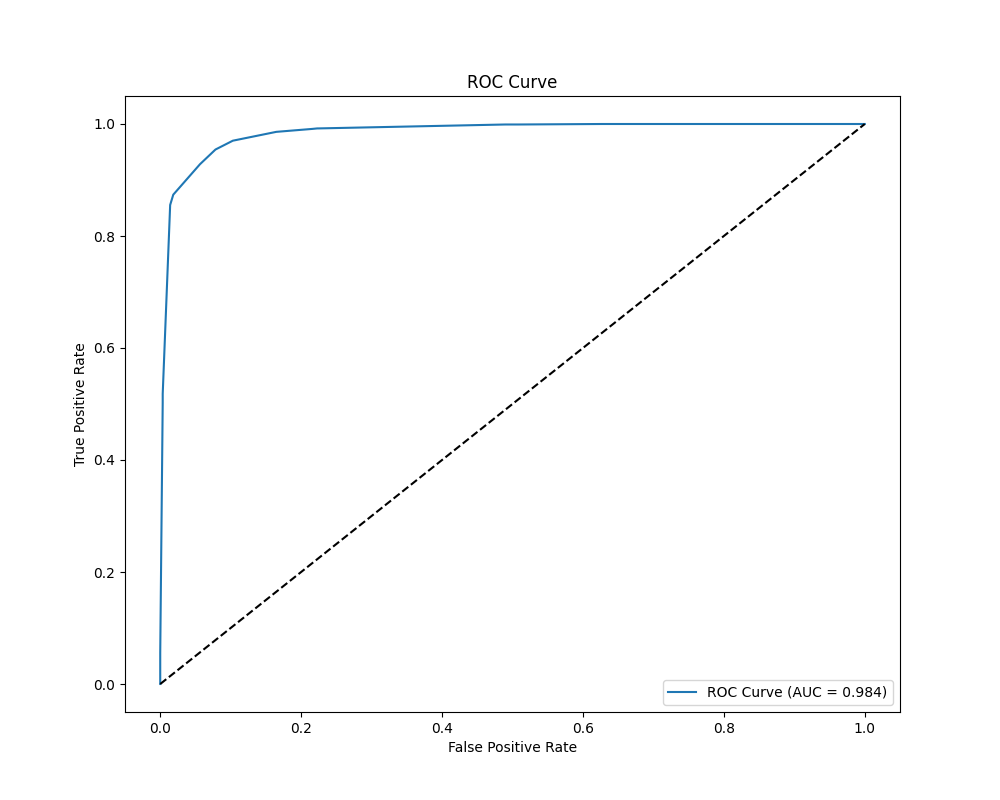
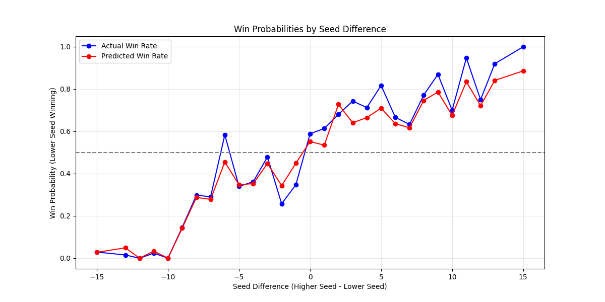

# NCAA25: March Madness Tournament Prediction System


A machine learning-based system to predict outcomes of NCAA basketball tournament games using historical data analysis, seed performance, and team statistics.
## Project Overview


This project is made for **NCAA 2025** competition in Kaggle 

My team reach the highest place at 6th position; 


NCAA25 uses historical NCAA tournament and regular season game data to build a predictive model that forecasts the probability of a team winning in tournament matchups. The system:

1. Analyzes team performance metrics from regular season and tournament games
2. Evaluates the impact of seeding on tournament outcomes
3. Identifies key statistical features that contribute to tournament success
4. Provides win probability predictions for all possible tournament matchups

The model achieves strong predictive performance with **AUC score of 0.984** and maintains good calibration between predicted probabilities and actual outcomes.

<div style="display: flex; gap: 10px;">
  
  
</div>


## Key Features

- **Data Processing Pipeline**: Automated system to ingest, clean, and process historical NCAA game data
- **Feature Engineering**: Extracts meaningful statistical features from raw game data
- **Random Forest Model**: Uses ensemble methods for robust prediction with feature importance analysis
- **Probability Calibration**: Isotonic regression for well-calibrated win probabilities
- **Model Analysis**: Comprehensive evaluation including ROC curves, precision-recall analysis, and upset probability assessment
- **Bracket Simulation**: Tools to simulate tournament outcomes based on model predictions

## Project Structure

```
NCAA25/
│
├── artifacts/               # Model outputs, processed data and analysis results
├── config/                  # Configuration files
│   └── config.yaml          # Main configuration parameters
├── logs/                    # Application logs
├── research/                # Jupyter notebooks for exploration
├── src/NCAA25/              # Source code
│   ├── components/          # Core components
│   │   ├── data_ingestion.py    # Data download and extraction
│   │   ├── data_preparation.py  # Data processing and feature engineering
│   │   ├── model_trainer.py     # Model training and evaluation
│   │   └── model_analysis.py    # Results analysis and visualization
│   ├── config/              # Configuration utilities
│   ├── constants/           # Project constants
│   ├── entity/              # Data classes and entities
│   ├── pipeline/            # Processing pipelines
│   │   ├── stage_01_data_ingestion.py  # Data acquisition pipeline
│   │   ├── stage_02_model_training.py  # Model training pipeline
│   │   └── stage_03_model_analysis.py  # Analysis pipeline
│   └── utils/               # Utility functions
├── templates/               # Web UI templates
├── main.py                  # Application entry point
├── params.yaml              # Model hyperparameters
└── requirements.txt         # Project dependencies
```

## Model Insights

The model reveals several key insights about NCAA tournament prediction:

### Feature Importance


The most significant predictors of tournament success are:

1. **Seed Difference**: The strongest predictor of tournament outcomes
2. **Team Seeds**: Individual team seeds carry substantial predictive power
3. **Seasonal Statistics**: Team performance metrics like defensive rebounding, offensive rebounding, and field goal percentage

### Performance Analysis




- **Well-calibrated probabilities**: Model predictions closely align with actual win rates
- **Strong Upset Detection**: Accurately identifies potential upsets when lower seeds have stronger statistics
- **High Precision-Recall**: Maintains high precision across different recall thresholds, even at high recall values
- **Seed Performance**: Clear relationship between seed difference and win probability, with accuracy increasing as seed difference grows

## Installation

```bash
# Clone repository
git clone https://github.com/yourusername/NCAA25.git
cd NCAA25

# Create and activate virtual environment
python -m venv venv
source venv/bin/activate  # On Windows: venv\Scripts\activate

# Install dependencies
pip install -r requirements.txt

# Install package in development mode
pip install -e .
```

## Usage

### Running the Pipeline

```bash
# Run the complete pipeline
python main.py

# Run individual stages
python -m src.NCAA25.pipeline.stage_01_data_ingestion
python -m src.NCAA25.pipeline.stage_02_model_training
python -m src.NCAA25.pipeline.stage_03_model_analysis
```

### Making Predictions

```python
from src.NCAA25.pipeline.stage_02_model_training import main as train_model
from src.NCAA25.components.model_trainer import ModelTrainer
from src.NCAA25.config.configuration import ConfigurationManager

# Train the model
train_model()

# Load configuration
config = ConfigurationManager()
model_config = config.get_model_trainer_config()

# Create submission file with predictions
model_trainer = ModelTrainer(config=model_config)
submission_path = model_trainer.create_submission("predictions.csv")
```

## Future Enhancements

- Deep learning models for more complex pattern recognition
- Player-level statistics incorporation
- Real-time data updates during tournament
- Web interface for interactive bracket predictions
- Opponent-adjusted efficiency metrics

## License

This project is licensed under the MIT License - see the LICENSE file for details.

## Acknowledgments

- NCAA for the historical tournament data
- The open-source community for machine learning tools and libraries
- Basketball analytics researchers for methodological insights